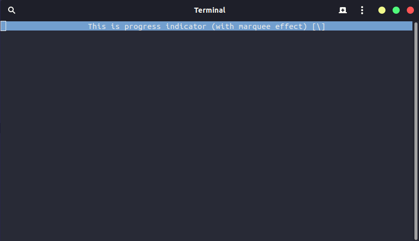

# Usage
First import `ProgressBar` namespace by `using` statement:
```csharp
using ProgressBar;
```

### Progress Bar


There are 2 methods in `ProgressBarManager` which manages the progress bar:
- `SetProgressBar`
- `ClearProgressBar`

To set progress bar, use `SetProgressBar` method. If you want to change text/value of progress bar, call this method too. To delete call `ClearProgressBar`.
Progress bar does not need `ProgressBarManager` class instance (static methods).

Code I used (on picture):
```csharp
ProgressBarManager.SetProgressBar(50, "This is half-filled progress bar:", "hi, I'm text from brackets");
```
#
### Progress Indicator


There are 3 methods in `ProgressBarManager` which manages the progress indicator:
- `SetProgressIndicator`
- `UpdateProgressIndicator`
- `ClearProgressIndicator`

To set progress indicator, use `SetProgressIndicator` method. If you want to change text on progress indicator, call `UpdateProgressIndicator` method. To delete call `ClearProgressIndicator`.
Progress indicator **works asynchronously**.

Code I used (on picture):
```csharp
ProgressBarManager manager = new ProgressBarManager();
await manager.SetProgressIndicator("This is progress indicator (with marquee effect)");
```
